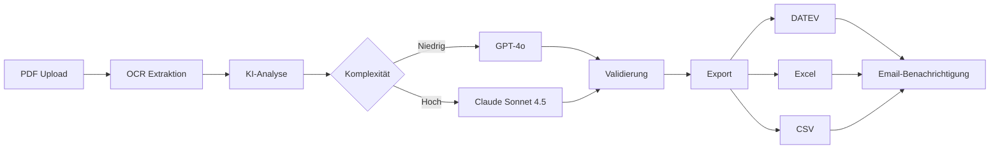

# 🤖 SBS KI-Rechnungsverarbeitung

> **Automatische Rechnungsverarbeitung mit Multi-Model KI für die Region Weinheim, Mannheim, Heidelberg**

[](https://www.python.org/)
[](https://fastapi.tiangolo.com/)
[]()
[]()

---

## 📋 Übersicht

Eine hochmoderne KI-gestützte Lösung zur automatischen Verarbeitung von Rechnungen. Das System kombiniert GPT-4o und Claude Sonnet 4.5 für höchste Genauigkeit und exportiert direkt nach DATEV, Excel und CSV.

### 🎯 Kernfunktionen

- ✅ **Multi-Model KI**: Intelligente Kombination aus GPT-4o und Claude Sonnet 4.5
- ✅ **99% Genauigkeit**: Präzise OCR-Technologie mit automatischer Plausibilitätsprüfung
- ✅ **DATEV-Export**: Nahtlose Integration für Steuerberater
- ✅ **90% Zeitersparnis**: 100 Rechnungen in 5 Minuten statt 8 Stunden
- ✅ **DSGVO-konform**: Automatische Datenlöschung nach 60 Minuten
- ✅ **Lokaler Support**: Persönliche Betreuung in Weinheim, Mannheim, Heidelberg

---

## 🚀 Features

### 🤖 **KI-Verarbeitung**
- Multi-Model-Routing: Automatische Wahl des optimalen Modells
- Komplexitätsberechnung für intelligente Modellauswahl
- OCR-Technologie für handgeschriebene Rechnungen
- Automatische Validierung und Plausibilitätsprüfung

### 📊 **Export-Formate**
- **DATEV**: CSV-Export nach DATEV-Standard
- **Excel**: Vollständig formatierte .xlsx-Dateien
- **CSV**: Standard-CSV für weitere Verarbeitung

### 🎨 **Web-Interface**
- Modern SBS Corporate Design
- Drag & Drop PDF-Upload
- Mehrfaches Hochladen möglich
- Echtzeit-Verarbeitungsanzeige
- Download-Center für alle Exporte

### 📧 **Email-Benachrichtigungen**
- Automatische Benachrichtigung nach Verarbeitung
- Anpassbare Empfängerliste
- LocalStorage für gespeicherte Email-Adressen

### 🔒 **Sicherheit & Compliance**
- DSGVO-konforme Datenhaltung
- Automatische Löschung nach 60 Minuten
- Keine persistente Speicherung sensibler Daten
- SSL/TLS-Verschlüsselung

### 📈 **Analytics & Monitoring**
- Google Analytics Integration
- Verarbeitungsstatistiken
- Erfolgs-/Fehlerrate-Tracking

---

## 🏗️ Technologie-Stack

### **Backend**
- **Framework**: FastAPI (Python 3.11+)
- **KI-Modelle**: 
  - OpenAI GPT-4o
  - Anthropic Claude Sonnet 4.5
- **OCR**: Tesseract + pdfplumber
- **Datenverarbeitung**: Pandas, openpyxl

### **Frontend**
- **Framework**: Vanilla JavaScript + Bootstrap 5
- **Design**: SBS Corporate Identity
- **Icons**: Unicode Emojis + Custom SVG

### **Deployment**
- **Server**: DigitalOcean Ubuntu 24.04
- **Web-Server**: Uvicorn (ASGI)
- **Prozess-Manager**: Systemd
- **Domain**: sbsdeutschland.com (geplant)

---

## 📦 Installation

### **Voraussetzungen**
```bash
# Python 3.11+
python3 --version

# System-Dependencies
sudo apt update
sudo apt install -y tesseract-ocr tesseract-ocr-deu poppler-utils
```

### **Projekt klonen**
```bash
git clone https://github.com/Luyzz22/ki-rechnungsverarbeitung.git
cd ki-rechnungsverarbeitung
```

### **Virtual Environment**
```bash
python3 -m venv venv
source venv/bin/activate
pip install -r requirements.txt
```

### **Umgebungsvariablen**
```bash
cp .env.example .env
nano .env
```

**.env Konfiguration:**
```env
# API Keys
OPENAI_API_KEY=sk-proj-...
ANTHROPIC_API_KEY=sk-ant-...

# Email (optional)
SMTP_SERVER=smtp.gmail.com
SMTP_PORT=587
SMTP_USERNAME=your@email.com
SMTP_PASSWORD=your-app-password
EMAIL_FROM=your@email.com
EMAIL_TO=recipient@email.com
```

---

## ⚙️ Konfiguration

**config.yaml** anpassen:
```yaml
llm_router:
  default_model: "gpt-4o"
  fallback_model: "claude-sonnet-4.5"
  complexity_threshold: 30

export:
  formats:
    - xlsx
    - csv
    - datev
  output_dir: "output"

notifications:
  email:
    enabled: true
    to_addresses:
      - "steuerberater@example.com"

datev:
  enabled: true
  company_number: "12345"
```

---

## 🖥️ Verwendung

### **Entwicklungs-Server starten**
```bash
source venv/bin/activate
uvicorn web.app:app --reload --host 0.0.0.0 --port 8000
```

### **Production-Deployment**
```bash
# Systemd Service
sudo cp invoice-app.service /etc/systemd/system/
sudo systemctl daemon-reload
sudo systemctl enable invoice-app
sudo systemctl start invoice-app
```

### **Web-Interface**
```
http://localhost:8000/          # Upload-Seite
http://localhost:8000/landing   # Landing Page
```

---

## 📊 API-Endpunkte

### **Upload**
```http
POST /api/upload
Content-Type: multipart/form-data

files: [file1.pdf, file2.pdf, ...]
```

### **Verarbeitung starten**
```http
POST /api/process/{batch_id}
```

### **Status abrufen**
```http
GET /api/status/{batch_id}
```

### **Download**
```http
GET /api/download/{batch_id}/xlsx
GET /api/download/{batch_id}/csv
GET /api/download/{batch_id}/datev
```

---

## 💰 Preise

### **🎁 Early Bird Special** (Erste 10 Kunden)
- **3 Monate kostenlos**
- Danach: **79€/Monat** (statt 119€)
- Alle Features inklusive
- Persönlicher Setup vor Ort

### **Reguläre Pakete**

| Paket | Preis | Rechnungen/Monat | Features |
|-------|-------|------------------|----------|
| **Starter** | 99€ | 100 | Basis-Features, Email-Support |
| **Professional** | 189€ | 500 | + Telefon-Support, Quartals-Review |
| **Enterprise** | Individuell | Unbegrenzt | + 24/7 Support, On-Premise |

**Jahres-Abo:** 2 Monate gratis!

---

## 🗂️ Projektstruktur
```
ki-rechnungsverarbeitung/
├── invoice_core.py          # Haupt-Verarbeitungslogik
├── llm_router.py            # Multi-Model KI-Router
├── export.py                # Excel/CSV Export
├── datev_exporter.py        # DATEV-Export
├── notifications.py         # Email-System
├── config.yaml              # Konfiguration
├── web/
│   ├── app.py              # FastAPI Backend
│   ├── templates/
│   │   ├── index.html      # Upload-Interface
│   │   └── results.html    # Ergebnis-Anzeige
│   └── static/
│       ├── sbs-logo.png    # SBS Logo
│       └── landing/
│           └── index.html  # Landing Page
├── output/                  # Export-Dateien
└── venv/                    # Virtual Environment
```

---

## 🎨 Screenshots

### Landing Page


### Upload Interface


### Ergebnisse


---

## 🔄 Workflow


---

## 📈 Roadmap

### **v5.0 (Q1 2026)**
- [ ] Batch-API für externe Integrationen
- [ ] Mobile App (iOS/Android)
- [ ] Automatisches Training auf Kundendaten
- [ ] Multi-Tenancy Support

### **v4.5 (Q4 2025)**
- [x] Landing Page mit Pricing
- [x] Google Analytics
- [x] Email-Benachrichtigungen
- [ ] SSL-Zertifikat (HTTPS)
- [ ] Domain-Anbindung (sbsdeutschland.com)

### **v4.4 (Aktuell)**
- [x] DATEV-Export
- [x] Multi-Model KI-Router
- [x] SBS Corporate Design
- [x] Auto-Löschung (DSGVO)

---

## 🤝 Beitragen

Dieses Projekt ist proprietär und nicht für externe Beiträge geöffnet.

Für Feature-Anfragen oder Bug-Reports:
- Email: luis@schenk.com
- Region: Weinheim, Mannheim, Heidelberg

---

## 📜 Lizenz

**Proprietary Software**

© 2025 SBS Deutschland GmbH & Co. KG. Alle Rechte vorbehalten.

Diese Software ist urheberrechtlich geschützt und darf nicht ohne ausdrückliche Genehmigung vervielfältigt, verbreitet oder modifiziert werden.

---

## 👨‍💻 Entwickler

**Luis Schenk**
- Email: luis@schenk.com
- Region: Weinheim, Baden-Württemberg
- GitHub: [@Luyzz22](https://github.com/Luyzz22)

---

## 📞 Kontakt & Support

### **Kontakt**
- 📧 Email: luis@schenk.com
- 🌐 Website: [sbsdeutschland.com](http://sbsdeutschland.com) (in Vorbereitung)
- 📍 Region: Weinheim • Mannheim • Heidelberg

### **Support-Zeiten**
- Starter: Email-Support (Mo-Fr, 9-17 Uhr)
- Professional: Telefon + Email (Mo-Fr, 9-18 Uhr)
- Enterprise: 24/7 Premium-Support

---

## 🙏 Danksagungen

- **OpenAI** für GPT-4o API
- **Anthropic** für Claude Sonnet 4.5 API
- **DigitalOcean** für Hosting
- **FastAPI** für das exzellente Web-Framework

---

<div align="center">

**Made with ❤️ in Weinheim, Germany**

[🚀 Jetzt kostenlos testen](http://207.154.200.239/landing) | [📧 Kontakt](mailto:luis@schenk.com)

</div>
