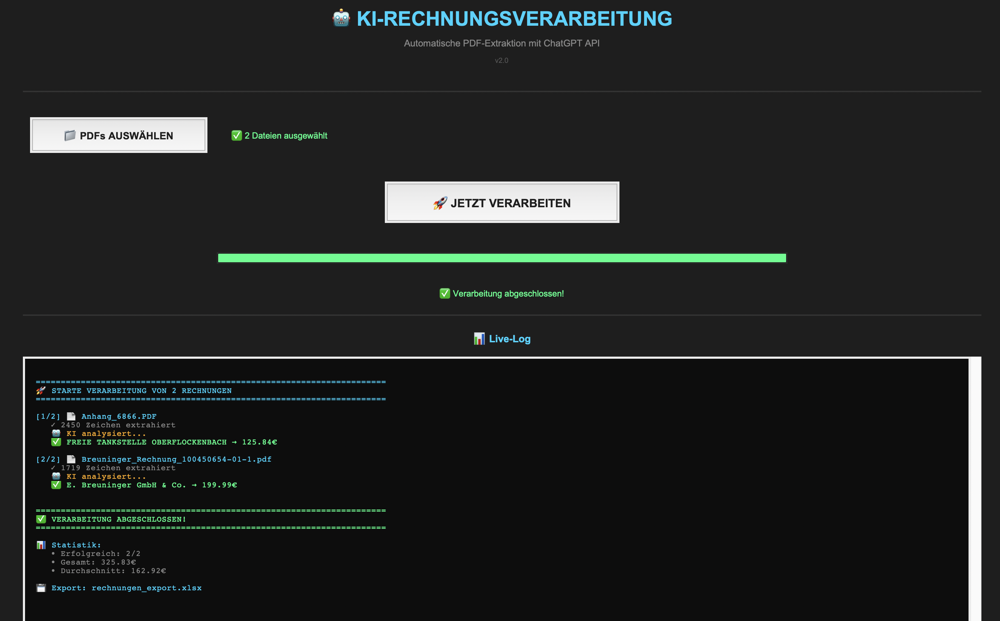
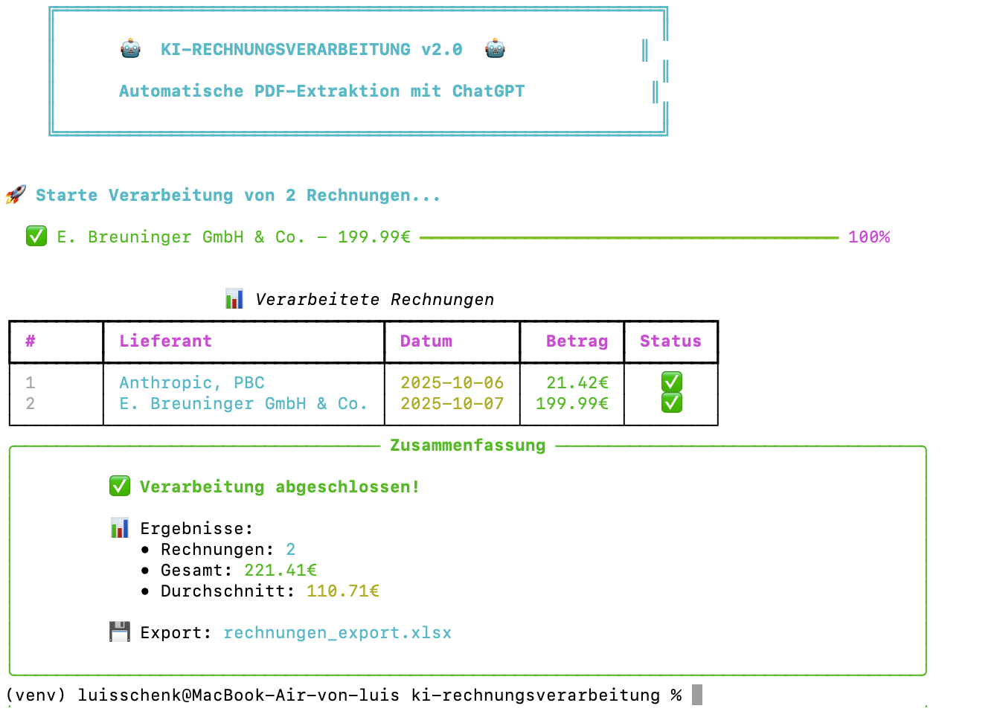

# 🤖 KI-Rechnungsverarbeitung

Automatische Extraktion von Rechnungsdaten aus PDFs mit ChatGPT API.


## 🎯 Problem

Unternehmen verschwenden **50-100 Stunden/Monat** mit manueller Rechnungseingabe in DATEV/Excel.

## ✅ Lösung

KI liest PDF-Rechnungen automatisch aus und extrahiert strukturierte Daten:

- ✅ Rechnungsnummer
- ✅ Datum & Fälligkeitsdatum  
- ✅ Lieferant & Adresse
- ✅ Beträge (Netto/Brutto/MwSt)
- ✅ IBAN & BIC
- ✅ Steuernummer & USt-IdNr

## 📊 Performance

| Metric | Wert |
|--------|------|
| **Speed** | 10 Sekunden/Rechnung |
| **Accuracy** | 95%+ |
| **Cost** | ~0,0005€/Rechnung |

## 💰 ROI

**Bei 500 Rechnungen/Monat:**

| | Vorher | Nachher | Ersparnis |
|---|---|---|---|
| **Zeit** | 83h/Monat | 1,4h/Monat | **81,6h** |
| **Kosten** | 3.320€ | 56€ | **3.264€/Monat** |

**Investment:** 12.000€ einmalig  
**Break-Even:** 3,7 Monate  
**Jahr 1 ROI:** 227%

## 🎬 Demo

### 🖥️ GUI Version v2.0 ⭐ NEU!



**Features:**
- ✅ Modernes Dark Theme Interface
- ✅ Datei-Browser mit Multi-Select
- ✅ Live-Fortschrittsbalken (100%)
- ✅ Echtzeit-Logging mit Farbcodierung
- ✅ Detaillierte Statistiken
- ✅ Success-Popup am Ende
- ✅ **Keine Kommandozeile nötig!**

**Perfekt für Demos & nicht-technische User!**
```bash
python invoice_parser_gui.py
```

---

### 🎨 CLI Version v2.0 ⭐ NEU!



**Features:**
- ✅ Schöne Box-Grafiken mit Unicode
- ✅ Farbiges Terminal (Grün/Cyan/Gelb)
- ✅ Live-Fortschrittsbalken
- ✅ Strukturierte Tabellen
- ✅ Summary-Panel mit Statistiken
- ✅ **Sieht aus wie Enterprise-Software!**

**Perfekt für Power-User & Server!**
```bash
python invoice_parser_v2.py
```

---

### 📟 Klassische CLI Version
```bash
python invoice_parser.py
```

**Basic aber funktional - für Automation & Scripts!**

---

## 🎯 3 Versionen für jeden Anwendungsfall

| Version | Interface | Zielgruppe | Command |
|---------|-----------|------------|---------|
| **GUI** | Grafisches Fenster | End-User, Demos | `python invoice_parser_gui.py` |
| **CLI v2** | Terminal (Pretty) | Power-User, Präsentationen | `python invoice_parser_v2.py` |
| **CLI Basic** | Terminal (Simple) | Automation, Cron-Jobs | `python invoice_parser.py` |

Alle 3 Versionen nutzen die gleiche KI-Engine und produzieren identische Excel-Outputs!

---

## 🎬 Live-Beispiel

**3 Rechnungen erfolgreich verarbeitet:**
```
✅ Anthropic, PBC           → 21,42€   (2025-10-06)
✅ E. Breuninger GmbH & Co. → 199,99€  (2025-10-07)
✅ Freie Tankstelle         → 125,84€  (2025-10-08)
━━━━━━━━━━━━━━━━━━━━━━━━━━━━━━━━━━━━━━━━━━━━━━━━━━━━
💰 Gesamt: 347,25€
📈 Durchschnitt: 115,75€
```

**Extrahierte Daten:**
- Rechnungsnummern ✅
- Datum ✅
- Lieferanten ✅
- Beträge (Netto/Brutto/MwSt) ✅
- IBANs ✅

**Zeit:** < 30 Sekunden für alle 3!

---

## 🔧 Tech-Stack
```
Python 3.10+
├── OpenAI API (gpt-4o-mini)
├── PyPDF2 (PDF-Parsing)
├── pandas (Datenverarbeitung)
├── openpyxl (Excel-Export)
├── rich (Beautiful CLI)
└── tkinter (GUI)
```

## 🚀 Installation
```bash
# 1. Repository klonen
git clone https://github.com/Luyzz22/ki-rechnungsverarbeitung.git
cd ki-rechnungsverarbeitung

# 2. Virtual Environment
python3 -m venv venv
source venv/bin/activate  # Mac/Linux
# venv\Scripts\activate   # Windows

# 3. Dependencies
pip install -r requirements.txt

# 4. OpenAI API-Key (.env Datei erstellen)
echo "OPENAI_API_KEY=your-key-here" > .env
```

## 📖 Usage

### GUI Version (Empfohlen für Demos)
```bash
python invoice_parser_gui.py
```

1. Klicke "PDFs AUSWÄHLEN"
2. Wähle deine Rechnungen
3. Klicke "JETZT VERARBEITEN"
4. Fertig! Excel wird erstellt

### CLI v2 (Schönes Terminal)
```bash
python invoice_parser_v2.py
```

Lege PDFs in `test_rechnungen/` Ordner und starte!

### CLI Basic (Automation)
```bash
# PDFs in Ordner legen
cp your-invoices/*.pdf test_rechnungen/

# Script ausführen
python invoice_parser.py

# Excel öffnen
open rechnungen_export.xlsx
```

---

## 💼 Für Unternehmen

**Interessiert an einer Lösung für Ihr Unternehmen?**

### Pakete

**Professional:** 12.000€
- Bis 2.000 Rechnungen/Monat
- Lokale Installation
- 2 Jahre Updates & Support
- Email-Support

**Enterprise:** Ab 25.000€
- Unbegrenzte Rechnungen
- DATEV-Integration
- Multi-User Support
- Custom Features
- Priority-Support
- On-Premise Deployment

**Beta-Rabatt:** Erste 5 Kunden: **5.000€** statt 12.000€ 🎉

### Kontakt

- 📧 **Email:** Luis@schenk.com
- 📱 **Phone:** +49 179 2063144
- 🔗 **GULP:** [gulp.de/spezialisten/profil/4cn1uh6sxn](https://www.gulp.de/gulp2/g/spezialisten/profil/4cn1uh6sxn)
- 💼 **LinkedIn:** Verfügbar auf Anfrage

**Kostenlose 15-Min-Demo verfügbar!**

---

## 🎯 Ideal für

- 🏦 **Steuerberater & Buchhaltungskanzleien** (300+ Mandanten)
- 🛒 **E-Commerce Unternehmen** (100-5.000 Rechnungen/Monat)
- 🚚 **Logistik & Spedition** (Viele Lieferantenrechnungen)
- 🔨 **Handwerksbetriebe** (Baustoff-Rechnungen)
- 🏢 **Jedes Unternehmen mit 100+ Rechnungen/Monat**

---

## 🏆 Features

### Core Features
- ✅ Batch-Processing (mehrere PDFs gleichzeitig)
- ✅ Excel-Export mit strukturierten Daten
- ✅ DSGVO-konform (100% lokale Verarbeitung)
- ✅ Intelligente Datenvalidierung
- ✅ Error-Handling & Logging
- ✅ Production-ready Code

### v2.0 Features
- ✅ 3 verschiedene Interfaces (GUI, CLI Pretty, CLI Basic)
- ✅ Live-Fortschrittsbalken
- ✅ Farbiges Terminal-Output
- ✅ Strukturierte Tabellen
- ✅ Summary-Statistiken
- ✅ Success-Popups

---

## 📈 Roadmap

### Geplant für v3.0
- [ ] DATEV-Export-Format
- [ ] Dashboard mit Charts (matplotlib/plotly)
- [ ] Email-Benachrichtigungen
- [ ] Multi-User Support
- [ ] REST API-Interface
- [ ] Docker-Deployment
- [ ] Web-Interface (Flask/FastAPI)
- [ ] Automated Tests
- [ ] CI/CD Pipeline

### In Planung
- [ ] Cloud-Version (SaaS)
- [ ] Mobile App
- [ ] OCR für gescannte PDFs
- [ ] Mehrsprachige Rechnungen
- [ ] Maschinelles Lernen für bessere Accuracy

---

## 🛠️ Für Entwickler

### Project Structure
```
ki-rechnungsverarbeitung/
├── invoice_parser.py          # CLI Basic
├── invoice_parser_v2.py       # CLI Pretty (Rich)
├── invoice_parser_gui.py      # GUI (Tkinter)
├── requirements.txt           # Dependencies
├── .env                       # API Keys (nicht in Git!)
├── .gitignore                # Git config
├── README.md                  # Diese Datei
└── test_rechnungen/          # Input-Ordner für PDFs
```

### Contributing

Contributions sind willkommen! Für größere Änderungen bitte vorher Issue öffnen.

### Testing
```bash
# Unit Tests (coming soon)
python -m pytest tests/

# Integration Tests mit echten PDFs
python invoice_parser.py
```

---

## 📄 License

**Proprietary** - Kontaktieren Sie uns für kommerzielle Lizenzen

Für Open-Source-Projekte: Kontakt aufnehmen für mögliche MIT-Lizenz

---

## 👨‍💻 Entwickler

**Luis Schenk**
- 🎓 Wirtschaftsjurist (B.A.) + Python-Entwickler
- 💼 Spezialisierung: Business Process Automation & Legal Tech
- 🏢 Praxis: Vibracoustic SE (Customs & Trade)
- 🌍 Sprachen: DE, EN, ES, FR, IT
- 💻 Portfolio: [github.com/Luyzz22](https://github.com/Luyzz22)

**Kombination aus:**
- ✅ Juristischem Verständnis (Compliance, DSGVO, Zollrecht)
- ✅ Technischer Umsetzung (Python, KI, APIs)
- ✅ Business-Denken (ROI, Prozessoptimierung)

---

## 📞 Support & Fragen

**Technische Fragen:**
- GitHub Issues: [github.com/Luyzz22/ki-rechnungsverarbeitung/issues](https://github.com/Luyzz22/ki-rechnungsverarbeitung/issues)
- Email: Luis@schenk.com

**Business-Anfragen:**
- Email: Luis@schenk.com
- Phone: +49 179 2063144

**Response Time:** < 24 Stunden (Werktags)

---

## 🌟 Credits

Built with:
- [OpenAI API](https://openai.com) - ChatGPT for data extraction
- [Rich](https://github.com/Textualize/rich) - Beautiful terminal formatting
- [pandas](https://pandas.pydata.org/) - Data processing
- [PyPDF2](https://pypdf2.readthedocs.io/) - PDF parsing

---

## ⭐ Star History

⭐ **Star this repo** if you find it useful!

Hilft bei:
- Sichtbarkeit für andere Entwickler
- Motivation für weitere Features
- Zeigt Interesse an dem Projekt

---

**Made with ❤️ in Weinheim, Germany 🇩🇪**

**© 2025 Luis Schenk - All Rights Reserved**

---

*Last Updated: 15. Oktober 2025*

